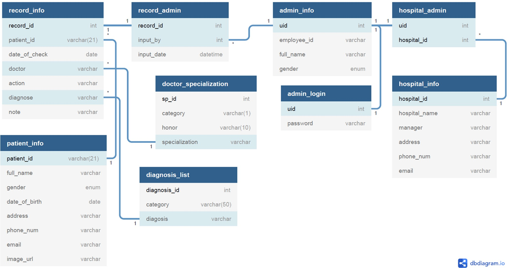

# MedRec - Medical Record Website and Database

This project was made to pass my Database Design and Architecture final exam on my 5th semester.

## Table of contents

- [Overview](#overview)
  - [About](#about)
  - [Database Schema](#database-schema)
- [My process](#my-process)
  - [Built with](#built-with)
  - [Process of making](#the-process)
  - [Future Improvement](#future-improvement)
- [Author](#author)
- [Acknowledgments](#acknowledgments)

## Overview

### About

MedRec is a website platfrom which purpose is to help the user (hospital admins) store and search for patients medical records easily.
Currently, there are 4 features of the MedRec website:

- Search record
- Add / register data
- Edit data
- Admin control

### Database Schema

## My process

### Built with

- HTML
- CSS
- Javascript
- XAMPP
- PHP
- MySQL

### Process of making

The first thing I do in this project was to create the database schema for MedRec's system. After the schema was set, I determined what pages should be included for MedRec's website. After all the pages was set, I asked my friend to design all the website's pages appearance and the designs was then converted into code using HTML, CSS, and Js, and with all of that, the first stage of the project, which is the frontend part, is done. 

After the frontend part is done, I began focusing on the backend part. Using XAMPP's PHPMyAdmin and MySQL language, I prepared the database needed to run MedRec based on the database schema that I had created at the beginning of this project. After the database is ready, I converted all the HTML files into PHP files and started inserting the backend functions. For every functions I added, I tested it out using XAMPP to make sure every function works properly.

### Future Improvement

With the limited time I have for creating this project, the frontend designs that I made only support desktop with 1920 x 1080 resolution, otherwise it will look like a mess. So for the next frontend improvement, I want to make the designs responsive to all resolutions and especially be a mobile-friendly design. I also hope to refactor my css codes, because I had just started learning css and I brute forced all the css codes to make this project. 

For the backend part, I have only managed to make a few features on this website which I believe can still be improved for better efficiency. I will also add in more necessary features and expand the database architecture accordingly so this website is more appropriate to be implemented in real practice. 

## Author

- Website - [Deaven Rivaldi](https://www.your-site.com)
- LinkedIn - [deavenrivaldi](https://www.linkedin.com/in/deavenrivaldi)
- Instagram - [deavenrivaldi](https://www.instagram.com/deavenrivaldi)

## Acknowledgments

I would like to express my special thanks of gratitude to my friend, Rani Nathania, for helping me with the design of MedRec's website and my leader at Prudential, Mrs. Korry Kawanto, for giving me insights on how I should create MedRec's database architecture. 
